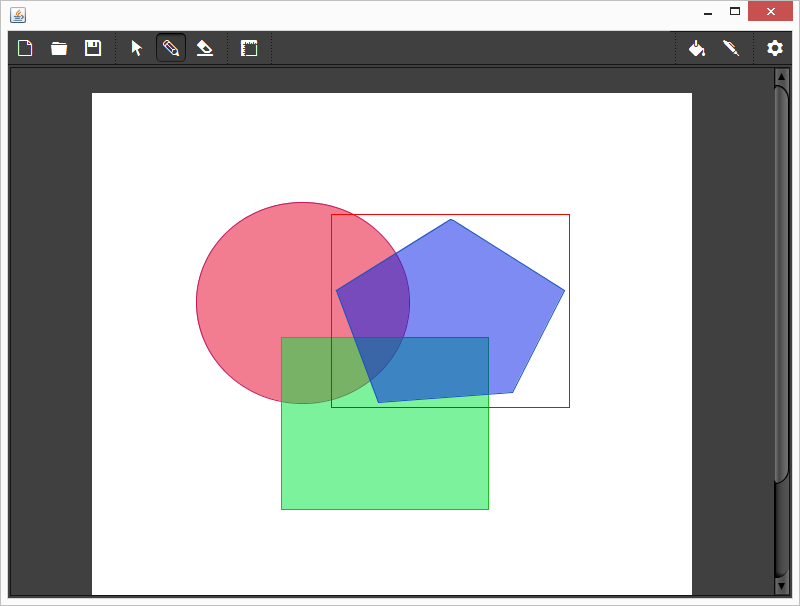

# CSE 3461 - User Interface
## Assignment 2 - Sketch Pad

### Purpose

Develop a JFC/Swing application that implements a drawing application.   The
application should include a variety of drawing capabilities, as typically
found in commercial drawing applications.  These include, but are not limited
to, drawing objects such as squares, circles, lines, etc., free-hand drawing,
inserting text; inserting an image from a file, operations for specifying line
color, and thickness, and fill color; zoom in, zoom out, undo; save; save as…,
open, etc. Can you think of additional features that might be useful?

[See details](REQUIREMENTS.md)

### Note

**DISCLAIMER**: This project is known to be buggy.
Unfortunately, the developers don't have the time currently to fix it.

This project will not be maintained.
Use at your own risk.
